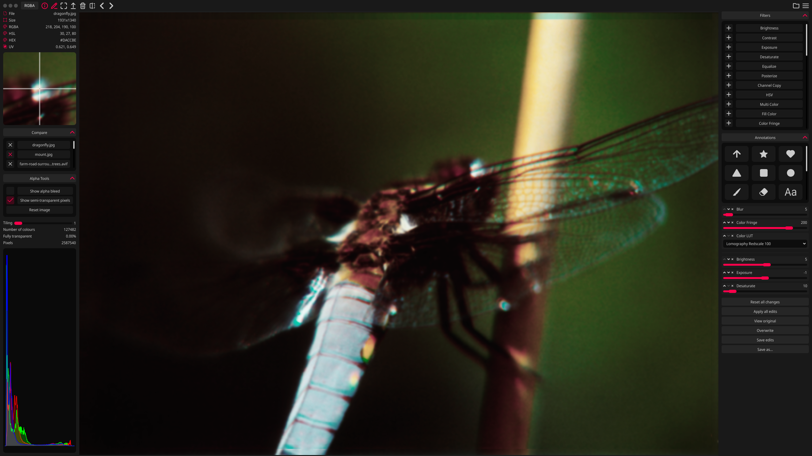
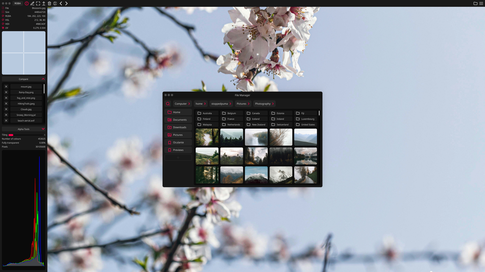
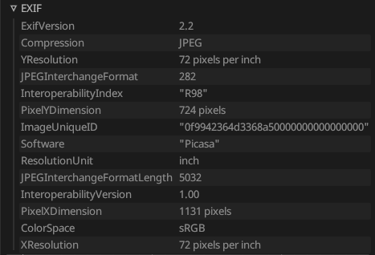
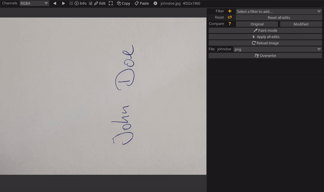

<h1 align="center">
    
</h1>

 _A no-nonsense hardware-accelerated image viewer_

[](https://github.com/woelper/oculante/releases/latest)

Oculante's vision is to be a fast, unobtrusive, portable image viewer with a wide range of supported image formats while also offering image analysis and basic editing tools.

Oculante is a free, open-source, bloat-free, and privacy-respecting image viewer that is fast to start up and open images. It is available on Windows, Mac, Linux, FreeBSD, and NetBSD, and supports a wide range of image formats. Oculante caches images for faster reloading and can correctly display unassociated channels. It also includes features for basic image analysis, and offers SIMD-accelerated, basic nondestructive editing tools such as cropping, resizing, painting, rotating, blurring, and more!

[](https://discord.gg/https://discord.gg/2Q6cF5ZWe7)
---
[](https://github.com/woelper/oculante/actions/workflows/check_osx.yml)
[](https://github.com/woelper/oculante/actions/workflows/check_netbsd_minimal.yml)
[](https://github.com/woelper/oculante/actions/workflows/check_ubuntu_no_default_features.yml)
[](https://github.com/woelper/oculante/actions/workflows/check_windows.yml)
[](https://github.com/woelper/oculante/actions/workflows/check_arm7.yml)
---




## Flipbook

With configurable caching, Oculante can quickly step through image sequences:


## Inspection

Get information about pixel values and position, with precise picking:


## File Management

Oculante's built-in File Manager allows you to access files on your system without leaving the application. This makes it easy to compare images, especially with the dedicated compare option that lets you flip between images while preserving the zoom level and position.



## Correct color channel display:

Images may contain color information that is masked by the alpha channel. Although it is present you will not see it since usually RGB values are multiplied with the A channel when displayed. Oculante allows you to inspect all channels individually and see color data without transparency applied.


## Installation

Find and download the correct executable for your operating system on the [releases](https://github.com/woelper/oculante/releases/latest) page. The download is small, around 25MB, as we link dependencies statically by default. We also have packages available for ARM Linux. Have a different OS? Please feel free to open an issue if you want your operating system of choice supported!

For those looking to manage Oculante through a package manager, please see the options below.

### Cargo

```sh
cargo install oculante
```

### Linux

- Arch Linux 

```sh
pacman -S oculante
```

```sh
paru -S oculante-git
```

- NixOS

```sh
environment.systemPackages = [
    pkgs.oculante
];
```

- openSUSE

```sh
zypper install oculante
```

- Flatpak

```sh
flatpak install flathub io.github.woelper.Oculante
```

### BSD

- FreeBSD

```sh
pkg install oculante
```

- NetBSD

```sh
pkgin install oculante
```

###### NetBSD builds currently use glsl-to-spirv instead of shaderc ######

### Windows

- Scoop

```sh
scoop install extras/oculante
```

## Build Dependencies

Linux (Debian):

`sudo apt-get install libxcb-shape0-dev libxcb-xfixes0-dev libgtk-3-dev libasound2-dev nasm cmake`

Windows:
Install Nasm from https://www.nasm.us/pub/nasm/releasebuilds/2.15.05/win64/

Mac:
`brew install nasm cmake`

## Updates

Oculante only gets updated when it improves something for you. You'll still see new releases about every month or two! To stay up to date you can use the update button in settings, or download the new release executable. Updates are also managed through your package manager if you installed through one.

## Uninstalling

To uninstall Oculante, simply delete the executable file and the data folder. You can find the data folder in the relevant location for your operating system below.

- Windows: `~/AppData/Local/.oculante`
- Mac: `~/Library/Application Support/oculante`
- Linux & BSD: `~/.local/share/oculante`

## Roadmap

You can see what we're currently working on in our [Release Plan](https://github.com/users/woelper/projects/2/views/1), or our [Milestones](https://github.com/woelper/oculante/milestones)!


## Features

- Image info: pixel position, color info, color histogram.
- Non-destructive editing, painting, and operator stack.
- Lossless JPEG editing: Crop, rotate, mirror without recompressing data.
- Built-in File Manager: Bookmark directories, favorite and manage files.
- Image tools: Image comparison, Measuring tools, Color pallete generation.
- User Interface: Dark/Light/System Themes, Zen Mode, Always on Top, Position/Scrub Bar, Fit image to view.
- Metadata and Metafile support: Load EXIF data and save metafile edit stacks.
- Focused on Performance: Threaded image loading, configurable image caching, Low cpu usage, pretty fast startup / loading time.
- Color Channel support: Display individual RGBA channels, unassociated / unpremultiplied alpha.
- Network listen mode: Start with `oculante -l port` and oculante will switch to receive mode, listening on that port.
- Load files from stdin: pipe your data with `cat image | oculante -s`.

### Image format support

- bmp
- gif (animation support and correct timing)
- hdr, tonemapped
- ico
- icns (via `rust-icns`)
- jpeg
- jpeg2000 (via `jpeg2k`, feature "j2k", on by default)
- png
- pnm
- tga
- jxl (JPEG XL, via `jxl-oxide`)
- avif
- tiff (via `tiff` with additional float/half support)
- webp (via `libwebp-sys` - `image` had _very_ limited format support)
- farbfeld
- DDS (DXT1-5, via `dds-rs`)
- DICOM (via dicom-rs) - Some metadata supported, too.
- psd (via `psd`)
- svg (via `resvg`)
- exr (via `exr-rs`), tonemapped
- RAW (via `quickraw` - nef, cr2, dng, mos, erf, raf, arw, 3fr, ari, srf, sr2, braw, r3d, nrw, raw). Since raw is a complex field without true standards, not all camera models are supported.
- ppm
- HEIC/HEIF (via `libheif-rs`). Enabled on Windows builds, but optional dependency on MacOS and Linux - available behind `heif` flag.
- qoi
- kra (Krita files)

### Misc examples:

Viewing EXIF data



Extracting a signature



## Credits

Photos used in tests and screenshots:

https://unsplash.com/@mohsen_karimi

https://unsplash.com/@frstvisuals

https://unsplash.com/@eberhardgross

UI Design:

[Stoppedpuma](https://github.com/Stoppedpuma)

## Privacy pledge

Oculante does in no way collect or send anonymous or non-anonynmous user data or statistics. Oculante is and will remain free and open-source. There will never be ads.
There are only two instances where oculante interacts with the network, and both never happen without being triggered by the user:
- Updating the application (must be triggered manually from settings)
- Listening for incoming images on a custom port (must be set on command line)

In addition, Oculante saves some settings locally, for example:
- UI accent color
- Keybindings
- Vsync preferences
- Whether the directory index bar is displayed
- Recent files

## License

This project is MIT licensed, but some parts such as the LUTs in res/LUT are under the GPL license. As a result, we're making our entire source code public. If you would like to use Oculante without publishing your source code, please remove any GPL-licensed components and their references.

### Extras
<details>
<summary>Cargo Features</summary>

- `turbo` (on by default), the turbojpeg library will not be used to open jpeg images. You won't need Nasm to be installed.

- `file_open` will enable/disable a OS-native file open dialog. This pulls in additional dependencies and is enabled by default. Disabling it will enable a custom file dialog. This will probably the default in the future.

- `notan_glsl-to-spirv` uses the spirv shader compiler

- `notan/shaderc` (on by default) uses shaderc as a shader compiler. Longer build time.

- `update` (on by default) enable app updating.

- `heif` HEIF format support.

- `avif_native` (on by default) Rust AVIF decoder.

- `dav1d` Tried and tested AVIF decoder, takes priority over `avif_native` if both are enabled.

- `jxlcms` (on by default) Required for complete JXL support.

- `j2k` (on by default) Support for jpeg2000.

</details> 

<details>
<summary>Extended Language Support</summary>

Oculante can support some additional languages such as Arabic, Chinese, Japanese, Korean. This support depends on if your system has a supported font family installed. One supported font family is [Noto Sans](https://fonts.google.com/noto/specimen/Noto+Sans).

### Simplified Chinese

- Heiti SC
- Songti SC
- Noto Sans CJK SC
- Noto Sans SC
- WenQuanYi Zen Hei
- SimSun
- Noto Sans SC
- PingFang SC
- Source Han Sans CN

### Traditional Chinese

- Source Han Sans HK

### Japanese

- Noto Sans JP
- Noto Sans CJK JP
- Source Han Sans JP
- MS Gothic

### Korean

- Source Han Sans KR

### Taiwanese

- Source Han Sans TW

### Arabic

- Noto Sans Arabic
- Amiri
- Lateef
- Al Tarikh
- Segoe UI

</details> 

<details>
<summary>Default Shortcuts</summary>

### Shortcuts:
`mouse wheel` = zoom

`left mouse`,`middle mouse` = pan

`ctrl + mouse wheel` = prev/next image in folder

`Right mouse` pick color from image (in paint mode)

<kbd>T</kbd> = AlwaysOnTop

<kbd>F</kbd> = Fullscreen

<kbd>I</kbd> = InfoMode

<kbd>E</kbd> = EditMode

<kbd>Right</kbd> = NextImage

<kbd>Home</kbd> = FirstImage

<kbd>End</kbd> = LastImage

<kbd>Left</kbd> = PreviousImage

<kbd>R</kbd> = RedChannel

<kbd>G</kbd> = GreenChannel

<kbd>B</kbd> = BlueChannel

<kbd>A</kbd> = AlphaChannel

<kbd>U</kbd> = RGBChannel

<kbd>C</kbd> = RGBAChannel

<kbd>V</kbd> = ResetView

<kbd>Minus</kbd> = ZoomOut

<kbd>Equals</kbd> = ZoomIn

<kbd>Key1</kbd> = ZoomActualSize

<kbd>Key2</kbd> = ZoomDouble

<kbd>Key3</kbd> = ZoomThree

<kbd>Key4</kbd> = ZoomFour

<kbd>Key5</kbd> = ZoomFive

<kbd>LShift</kbd> + <kbd>C</kbd> = CompareNext

<kbd>LShift</kbd> + <kbd>Left</kbd> = PanLeft

<kbd>LShift</kbd> + <kbd>Right</kbd> = PanRight

<kbd>LShift</kbd> + <kbd>Up</kbd> = PanUp

<kbd>LShift</kbd> + <kbd>Down</kbd> = PanDown

<kbd>Delete</kbd> = DeleteFile

<kbd>LShift</kbd> + <kbd>Delete</kbd> = ClearImage

<kbd>RBracket</kbd> = LosslessRotateRight

<kbd>LBracket</kbd> = LosslessRotateLeft

<kbd>LControl</kbd> + <kbd>C</kbd> = Copy

<kbd>LControl</kbd> + <kbd>V</kbd> = Paste

<kbd>LControl</kbd> + <kbd>O</kbd> = Browse

<kbd>Q</kbd> = Quit

<kbd>Z</kbd> = ZenMode

</details>
