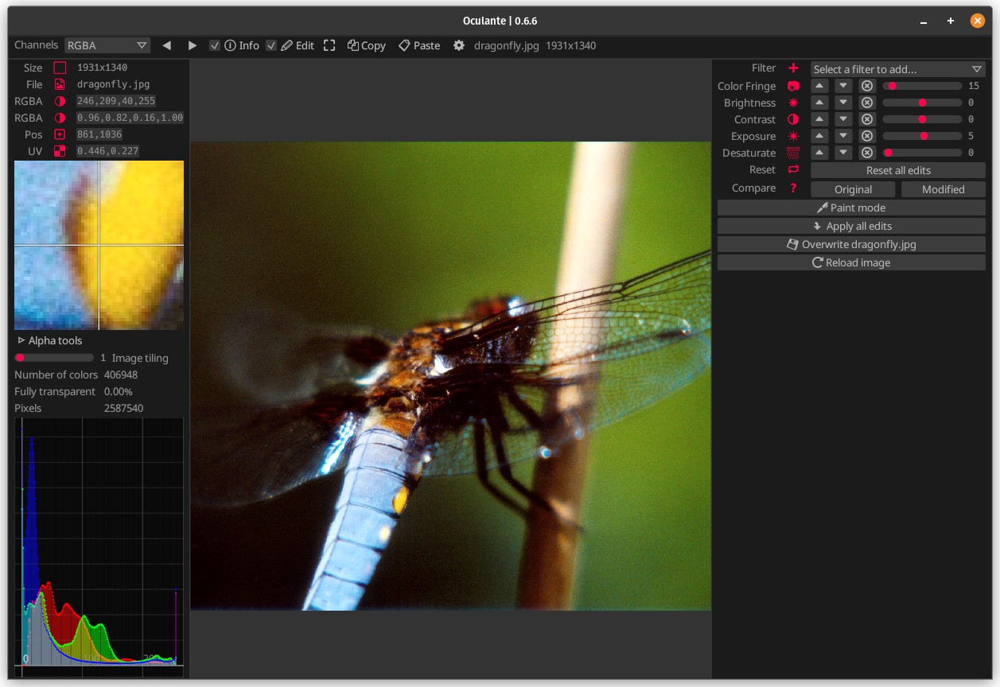
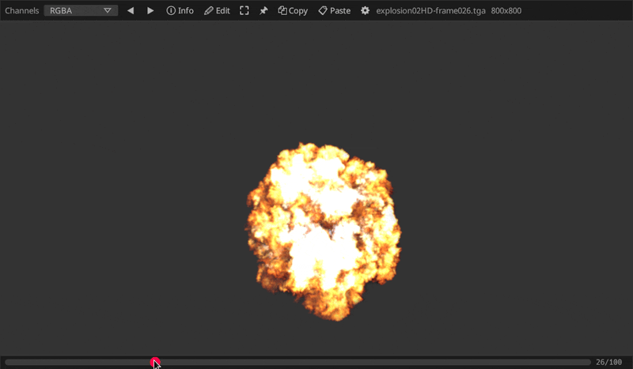
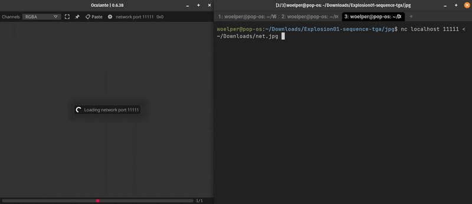

# Oculante


_A no-nonsense hardware-accelerated image viewer_


Oculante's vision is to be a fast, unobtrusive, portable image viewer with wide image format support, offering image analysis and basic editing tools.
- Free of charge, bloat-free, ad-free, privacy-respecting open source application
- Fast opening of images, fast startup
- Available for Win, Mac, Linux and NetBSD
- Supports a wide range of images and SVG
- Caches images for faster reloading
- Can display unassociated channels correctly (If your image uses alpha and color channels to encode data in a special way)
- Lets you pick pixels, display location and color values
- Offers basic nondestructive editing: Crop, resize, paint, contrast, HSV, rotate, blur, noise, ...
- SIMD-accelerated image editing

[](https://github.com/woelper/oculante/actions/workflows/osx.yml)
[](https://github.com/woelper/oculante/actions/workflows/netbsd_minimal.yml)
[](https://github.com/woelper/oculante/actions/workflows/ubuntu.yml)
[](https://github.com/woelper/oculante/actions/workflows/windows.yml)
[](https://github.com/woelper/oculante/actions/workflows/arm7.yml)




## Flipbook
With configurable caching, Oculante can quickly step through image sequences:


## Inspection
Get info about pixel values and position, with precise picking:


## Network
Raw image data can be sent to Oculante and will be loaded if possible, regardless of format. Streams of images will be played as a video. You can send images from cameras or headless systems such as a Raspberry Pi for example.


## Correct color channel display:
Images may contain color information that is masked by the alpha channel. Although it is present you will not see it since usually RGB values are multiplied with the A channel when displayed. Oculante allows you to inspect all channels individually and see color data without transparency applied.


## Installation
Oculante needs no installation, as it is just one executable. Just download it for your system from the releases tab (https://github.com/woelper/oculante/releases). In order to open images you can configure your system to open your desired image formats with oculante, drag them onto the executable or into the window. Right now the executables are roughly 20MB, as the default is to statically link dependencies. Minimal versions with less image formats are provided for older computers/tiny systems. Packages for Arm linux are also built. Please open an issue if you want your operating system of choice supported.

On NetBSD, a pre-compiled binary is available through the native package manager.
To install it, simply run
```sh
pkgin install oculante
```

## Features

### Image format support:
- bmp
- gif (animation support and correct timing)
- hdr, tonemapped
- ico
- jpeg
- png
- pnm
- tga
- jxl (JPEG XL, via `jxl-oxide`)
- avif
- tiff (via `tiff` with additional float/half support)
- webp (via `libwebp-sys` - `image` had _very_ limited format support)
- farbfeld
- DDS (DXT1-5, via `dds-rs`)
- psd (via `psd`)
- svg (via `resvg`)
- exr (via `exr-rs`), tonemapped
- RAW (via `quickraw` - nef, cr2, dng, mos, erf, raf, arw, 3fr, ari, srf, sr2, braw, r3d, nrw, raw). Since raw is a complex field without true standards, not all camera models are supported.
- ppm

### Platform support:
- Linux
- Mac
- Windows
- NetBSD

### Misc features
- Image info (<kbd>i</kbd>) (pixel position, color info)
- Threaded image loading
- Fit image to view
- Window can be configured to be always on top - helpful to keep image as reference
- Low cpu usage
- Non-destructive painting and operator stack - edit very large images interactively by scaling them down first, then deleting the downscale operator once you want to export.
- Metafile support: Edit stack can be saved into a metafile which will be auto-loaded and applied when loading the original.
- Pretty fast startup / loading time
- Configurable image caching (Select how many images to keep in memory)
- Display unassociated / unpremultiplied alpha (<kbd>u</kbd>)
- Lossless JPEG editing: Crop, rotate, mirror without recompressing data
- Network listen mode: Start with `oculante -l port` and oculante will switch to receive mode. You can then pipe raw image data to that port, for example using `nc localhost 8888 < image.jpg`. Image types will be auto-detected. If you pipe image sequences, these will be played at about 30 fps so you can pipe videos to it. This can be useful to visualize images from a headless system.

### Misc examples:

EXIF display


Extract a signature


## Roadmap:
- ~~Image loading time is still worse than feh or xv~~ This is now very close, in particular after switching to `turbojpeg`
- Tests and benchmarks
- Image rotation (and read EXIF for that)
- Investigate PVR / ETC support
- Brighness/gamma adjust for HDR
- ~~SVG support~~
- ~~Custom display for images with unassociated channels~~
- ~~EXR support~~
- ~~Read next image(s) in dir and advance to them~~

### Privacy pledge
Oculante does in no way collect or send anonymous or non-anonynmous user data or statistics.
Oculante is and will remain free and open source.
There will never be ads.
There are only two instances where oculante interacts with the network, and both never happen without being triggered by the user:
- Updating the application (must be triggered manually from settings)
- Listening for incoming images on a custom port (must be set on command line)

In addition, oculante saves some settings locally, for example:
- UI accent color
- Keybindings
- Vsync preferences
- Keep view offset/scale
- Whether the directory index bar is displayed
- Recent files

## Attribution
Test / benchmark pictures:

https://unsplash.com/@mohsen_karimi

https://unsplash.com/@frstvisuals

## Building

Linux:

`sudo apt-get install libxcb-shape0-dev libxcb-xfixes0-dev libgtk-3-dev libasound2-dev nasm cmake`

Win:
Install Nasm from https://www.nasm.us/pub/nasm/releasebuilds/2.15.05/win64/

Mac
`brew install nasm`

### Cargo Features
If you disable `turbo` (on by default), the turbojpeg library will not be used to open jpeg images. You won't need Nasm to be installed.
The feature `file_open` will enable/disable a file open dialog. This pulls in additional dependencies and is enabled by default.

### Shortcuts:
`mouse wheel` = zoom

`left mouse`,`middle mouse` = pan

`ctrl + mouse wheel` = prev/next image in folder

`Right mouse` pick color from image (in paint mode)


<kbd>T</kbd> = AlwaysOnTop

<kbd>F</kbd> = Fullscreen

<kbd>I</kbd> = InfoMode

<kbd>E</kbd> = EditMode

<kbd>Right</kbd> = NextImage

<kbd>Home</kbd> = FirstImage

<kbd>End</kbd> = LastImage

<kbd>Left</kbd> = PreviousImage

<kbd>R</kbd> = RedChannel

<kbd>G</kbd> = GreenChannel

<kbd>B</kbd> = BlueChannel

<kbd>A</kbd> = AlphaChannel

<kbd>U</kbd> = RGBChannel

<kbd>C</kbd> = RGBAChannel

<kbd>V</kbd> = ResetView

<kbd>Minus</kbd> = ZoomOut

<kbd>Equals</kbd> = ZoomIn

<kbd>Key1</kbd> = ZoomActualSize

<kbd>Key2</kbd> = ZoomDouble

<kbd>Key3</kbd> = ZoomThree

<kbd>Key4</kbd> = ZoomFour

<kbd>Key5</kbd> = ZoomFive

<kbd>LShift</kbd> + <kbd>C</kbd> = CompareNext

<kbd>LShift</kbd> + <kbd>Left</kbd> = PanLeft

<kbd>LShift</kbd> + <kbd>Right</kbd> = PanRight

<kbd>LShift</kbd> + <kbd>Up</kbd> = PanUp

<kbd>LShift</kbd> + <kbd>Down</kbd> = PanDown

<kbd>RBracket</kbd> = LosslessRotateRight

<kbd>LBracket</kbd> = LosslessRotateLeft

<kbd>LControl</kbd> + <kbd>C</kbd> = Copy

<kbd>LControl</kbd> + <kbd>V</kbd> = Paste

<kbd>LControl</kbd> + <kbd>O</kbd> = Browse

<kbd>Q</kbd> = Quit

<kbd>Z</kbd> = ZenMode

